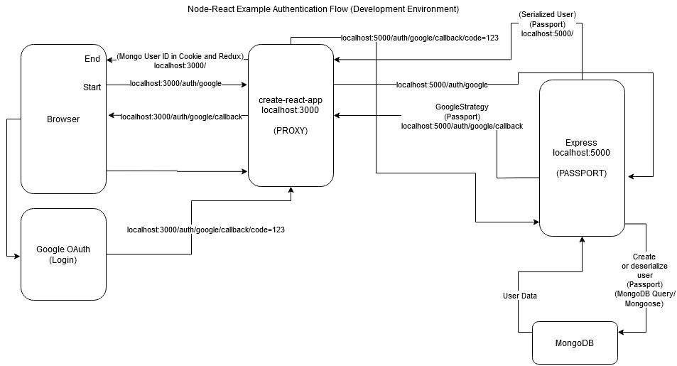
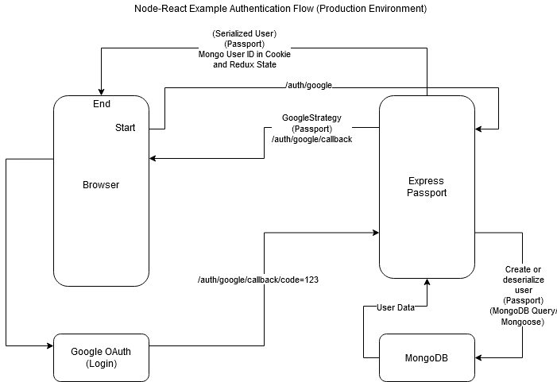

## Example Node/React Full-stack Web Application ##
This is a basic example of a Fullstack web application with Node, React, Redux,
and MongoDB based on a Udemy course.

[Heroku Example Deployment](https://enigmatic-river-32450.herokuapp.com/)

#### Requirements ####
* [Node and NPM (Node Package Manager)](https://nodejs.org/)
* [MongoDB](https://www.mongodb.com/)
* [Google OAuth 2.0 Keys](https://support.google.com/cloud/answer/6158849?hl=en)
* [Random hash or string for a cookie key](https://www.openssl.org/docs/man1.0.2/man1/rand.html)
* [Stripe API Key](https://stripe.com/)
* [Sendgrid API Key](https://stripe.com/)

#### What is this repository for? ####

* A full-stack web application that allows a user to sign up, purchase credits, and then customize an email campaign for a list of email addresses.

* Version 0.1

#### How do I get set up? ####

* Clone the repo \
`git clone https://github.com/SumDimGoy/nodereact-example.git`

* Install dependencies \
`npm install`

* [Add Authorized JavaScript Origins and Redirect URIs for Google OAuth](https://developers.google.com/identity/sign-in/web/server-side-flow)

  * Development:
    * Javascript Origin:
      `<http>://<ipaddress:5000>`

    * Redirect URIs:
      `<http|https>://<ipaddress>:3000/auth/google/callback`
      `<http|https>://<ipaddress>:5000/auth/google/callback`

  * Production:
    * Javascript Origin:
      `<http|https>://<deployment URL>`

    * Redirect URIs:
      `<http|https>://<deployment URL>/auth/google/callback`

* [Create MongoDB Cluster and Database](https://docs.atlas.mongodb.com/getting-started/) \
For local Deployment, whitelist your own IP address. For Heroku/production deployment use `0.0.0.0/0`
<br>

#### Local Deployment ####
* Create config/dev.js:
  ```javascript
  module.exports = {
    googleClientID: '<Google OAuth Client ID>',
    googleClientSecret: '<Google OAuth Client Secret>',
    mongoURI: '<MongoDB Connection String>',
    cookieKey: '<Hash/Cookie Key>',
    stripePublishableKey: '<Stripe Publishable API Key>',
    stripeSecretKey: '<Stripe Secret API Key>',
    sendgridKey: '<Sendgrid API Key>',
    redirectDomain: '<deployment url or localhost:3000>'
  }
  ```

* Log into your Sendgrid account, and navigate to Settings > Mail Settings > Event Webhook
  *  In a terminal window, run `npx ngrok localhost:3000`
  * Copy the forwarding url `<http|https>://<randomstring>.ngrok.io` into the HTTP Post URL field. Make sure that 'clicked' events are checked to be posted. Save.

* To start the server: <br />
`npm run dev`

#### Heroku Deployment #####
* [Login to Heroku and set environment variables:](https://devcenter.heroku.com/articles/config-vars)
  ```
  GOOGLE_CLIENT_ID = <Google OAuth Client ID>
  GOOGLE_CLIENT_SECRET = <Google OAuth Client Secret>
  MONGO_URI = <MongoDB Connection String>
  COOKIE_KEY = <Hash/Cookie Key>
  STRIPE_PUBLISHABLE_KEY = <Stripe Publishable API Key>
  STRIPE_SECRET_KEY = <Stripe Secret API Key>
  SENDGRID_KEY = <Sendgrid API Key>
  REDIRECT_DOMAIN = <deployment url or localhost:3000>
  ```


 * [Deploying NodeJS on Heroku](https://devcenter.heroku.com/articles/deploying-nodejs)

 * Log into your Sendgrid account, and navigate to Settings > Mail Settings > Event Webhook
   * Copy the deployment url into the HTTP Post URL field. Make sure that 'clicked' events are checked to be posted. Save.

* It is recommended to have separate databases for each deployment. Verify that your application is running by navigating to the application's URL in the browser.

* To test payment API functionality, use the following dummy information:<br />
  <ul>(The verification portion is not necessary and can be closed) <br /></ul>
	<ul>Email: anyaddress@abc123.com</ul>
	<ul>Card Number: 4242 4242 4242 4242<br></ul>
	<ul>Exp: 12/20</ul>
	<ul>CVV: 123</ul>


<br><br>

